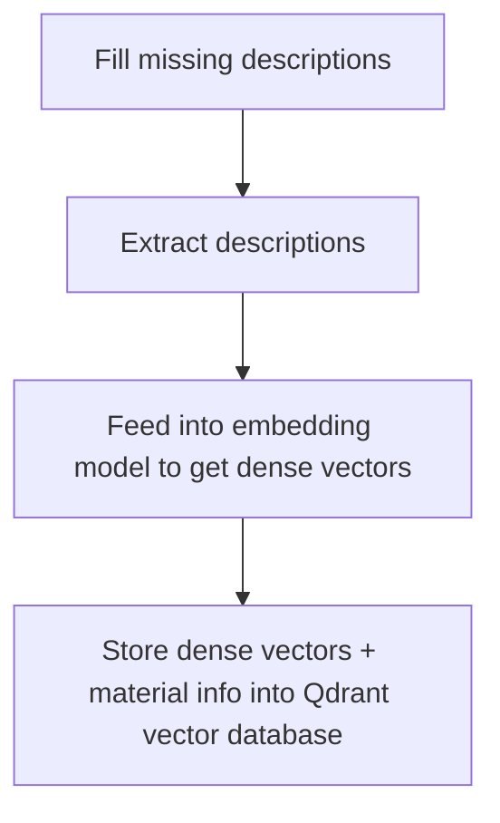

# Embedding Pipeline for Fabric Materials

## Step Overview



## Environment Setup

Before running the pipeline, ensure your environment is properly configured.

### 1. Install Required Packages

```bash
pip install pandas openai qdrant-client
```

### 2. Set Environment Variables

You must have your OpenAI API key set as an environment variable:

```bash
export OPENAI_API_KEY="your_openai_api_key_here"
```

Optionally, if you are connecting to a remote Qdrant instance and need an API key:

```bash
export QDRANT_API_KEY="your_qdrant_api_key_here"
```

(If using a local Qdrant server without authentication, this step can be skipped.)

### 3. Optional: Install Qdrant Locally (Docker)

If you want to run a local Qdrant server:

```bash
docker run -p 6333:6333 qdrant/qdrant
```

This will launch Qdrant on `http://localhost:6333`.

## Notes

- **Fill missing descriptions**: Ensure all materials have a natural language description before embedding.
- **Embedding model**: The pipeline uses `text-embedding-3-large` from OpenAI.
- **Storage**: Each vector, along with its corresponding material metadata, is stored in Qdrant for efficient semantic search and retrieval.

---

> This README describes the high-level flow and environment setup. See the codebase for detailed function implementations.

